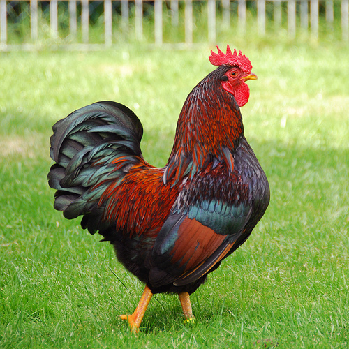

# LOBA_XAI

# XAI-image-classifiers-models

This repo aims to use adverserial attacks[1] to explain the outcomes of a image classifier model "without" having access to the model weights. The adverserial algorithm utilizes the low frequency boundary attack[2] and is modified based on the implementation from (https://github.com/cg563/low-frequency-adversarial).



### How to run
``` 
# install required packages
conda env create -f bb_adv.yml

# run demo on jupyter notebook
python loba_xai.py
```
<a id="1">[1]</a> 
Arash Rahnama, Andrew Tseng (2021).
An Adversarial Approach for Explaining the Predictions of Deep Neural Networks
CVPR Workshops, 2021, pp. 3253-3262.

<a id="2">[2]</a> 
Chuan Guo and Jared S. Frank and Kilian Q. Weinberger (2018)
Low Frequency Adversarial Perturbation
arXiv preprint arXiv:1809.08758
